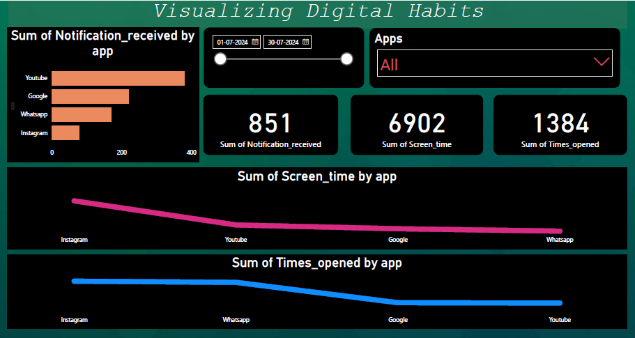

# A Power BI Analysis of Mobile App Usage -  Visualizing Digital Habits 

## INTRODUCTION

In our increasingly digital world, understanding personal device usage can offer valuable insights into how we manage our time and attention. This Power BI dashboard project delves into my own mobile device data, analyzing key trends and patterns related to screen time, notifications received, and the frequency of app openings. By examining this data, I aim to uncover insights into my digital habits, identifying which apps command the most attention, how notifications influence my device usage, and when I'm most engaged with my smartphone.

Through this analysis, I hope to gain a clearer understanding of my interaction with technology, providing a foundation for more mindful and balanced digital habits.

*Disclaimer - The data used in this project is personally recorded from my own mobile device and reflects my individual usage patterns. Any insights or trends identified are specific to my behavior and may not represent broader user experiences.*

## Problem Statement
1. Which day has the highest screen time ?
2. Which App receives the most notification ?
3. Which day has the most app opening ?
4. Is There a Correlation Between Notifications Received and Screen Time ?
5. Which App Is Opened the Most Frequently ?
6. Which Day of the Week Sees the Least Mobile Activity ?
7. Do Certain Apps Dominate Usage on Specific Days ?
8. How Does Screen Time Vary Across the Week ?
9. What’s the Relationship Between App Openings and Screen Time ?
10. Are There Specific Days When Certain Apps Receive More Notifications ?

## Skills / Concept Demonstrated

- Data Entry and record
- Data Transformation
- Math and Statistical Analysis
- Buttons
- Data Analysis
- Dashboard building

## Visualization / Dashboard 

**Dashboard Overview**

This Power BI dashboard is designed to provide a comprehensive view of my mobile device usage on a single page. It includes multiple visualizations, all of which are interconnected through filters and slicers, allowing for dynamic exploration of the data. The dashboard presents insights into key metrics such as screen time, app openings, and notifications received, all of which are broken down by app, day, and other relevant dimensions.

**Key Features:**
- **Filters and Slicers:** The dashboard includes interactive filters and slicers for selecting specific apps, days of the week, or date ranges. These tools enable a customized view of the data, allowing for quick and easy exploration of different usage patterns.
- **Unified Dashboard:** All relevant visualizations are displayed on a single page, providing a holistic view of the data. Whether it's identifying the app with the most screen time or determining peak usage periods, the dashboard delivers all the answers in one place.
- **Comprehensive Insights:** Each visualization on the dashboard contributes to a deeper understanding of mobile usage trends, from which apps are most frequently opened to how notifications impact screen time.

This user-friendly setup ensures that all the critical questions about mobile device usage are addressed efficiently, making the dashboard a powerful tool for analyzing and understanding personal digital habits.

## Analysis
- Friday has the highest screen time, indicating peak device usage on this day.
- Youtube receives the most notifications, making it the most attention-demanding app.
- Instagram records the highest number of app openings, showing increased app activity.
- There is a moderate/strong correlation between high notifications and increased screen time, especially on Youtube.
- Instagram and Whatsapp are the most frequently opened app, highlighting frequent user engagement.
- Google has the least mobile activity, with the lowest screen time and app openings.
- Instagram dominates usage on Friday, with significantly higher screen time or openings.
- Screen time is highest on Friday, with lower usage on Sunday, showing a weekly usage pattern.
- The frequently opened app Whatsapp is not necessarily the app with the max screen time .
- Youtube receives the most notifications on Monday, potentially driving higher screen time or app openings.

## Conclusion
The Power BI dashboard provides a comprehensive analysis of my mobile device usage, revealing significant trends and patterns in screen time, app openings, and notifications received. The data highlights specific days with peak activity, particularly in terms of screen time and app engagements, and shows a clear correlation between high notifications and increased device usage. The analysis also identifies key apps that dominate my attention, with notable differences between the most frequently opened apps and those with the most screen time. Overall, this dashboard offers valuable insights into my digital habits, enabling more informed decisions about managing screen time and app usage.

## Recommendation
- Set app-specific usage goals to limit screen time on days with peak activity.
- Reduce engagement with apps that generate the most notifications, as they drive significant screen time and frequent openings.
- Utilize digital well-being tools to monitor and manage app usage, focusing on those apps that consume the most time.
- Implement time blocks for productivity to minimize non-essential app interactions during peak periods.
- Regularly review usage patterns to adjust time management strategies for optimal digital well-being.

